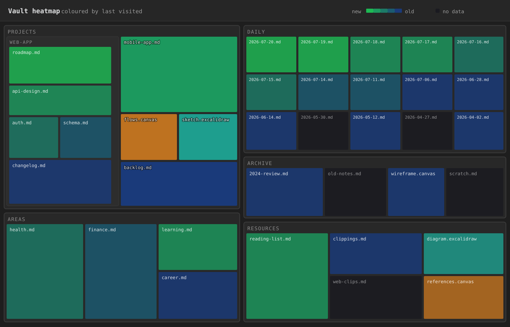
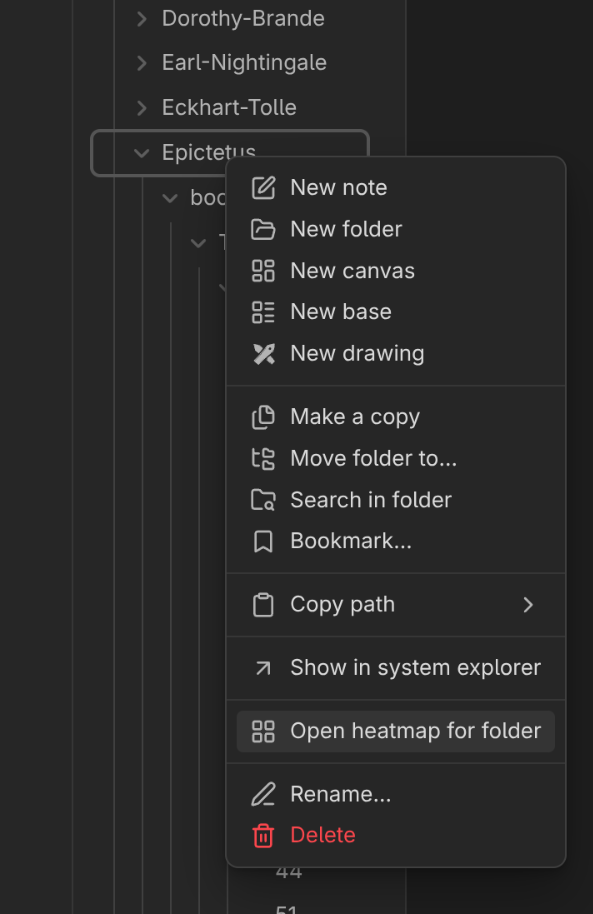

# Visit History

Ever wonder which notes you *actually* spend time in? Visit History quietly
records how long you focus on each note, canvas, and Excalidraw drawing, then
shows your whole vault as a colourful **activity heatmap** — so you can see, at a
glance, what's hot, what's gone cold, and what you've never touched.

Everything runs **fully offline and local**: no network calls, no accounts, no
telemetry. Your history never leaves your machine.



*Vault activity coloured by how recently each file was visited (illustrative).
Brighter green = recent, deep blue = long ago, dim = no data yet.*

## What it does

**Visit recording.** Open a note, canvas, or Excalidraw drawing and Visit
History times how long it stays in focus. When you move on — navigate away,
switch windows, or go idle — it saves that session (start time + duration). Over
time you get an honest picture of where your attention goes.

**Vault heatmap.** A zoomable **treemap** of your entire vault: every file is a
rectangle nested inside its folders.

- **Size = file size** — bigger files, bigger tiles.
- **Colour = activity** — either **by type** (note / canvas / Excalidraw) or
  **by recency**: how recently each file was **created**, **modified**, or
  **visited**. Recent files glow; stale ones fade.
- **Drill down** — click a folder to zoom in, step back up the trail, click a
  file to open it. Pan and zoom with the mouse.
- **Filter** — narrow the view to files matching a **path** or their text
  **content**. Filters combine with **OR**: a file shows if it matches *any*
  term.
- **`_archive` folders are hidden** by default (open one from its folder menu to
  look inside).
- Heatmap can also be opened from the `Files` view for specific folder:



### No visit history yet? The heatmap still works

You don't need any recorded visits to get value on day one. Colour the heatmap by
**created** or **modified** time and it immediately highlights your recently
edited and newly created files across the whole vault — visit-based colouring
then layers on top as you use the plugin. See the appendix if your files'
modified times look wrong after a `git` clone.

## Your history survives renames

Notes get renamed; folders get reorganised. The first time you open a note or
canvas, the plugin assigns it a small, permanent **id** (in the note's
frontmatter, or the canvas's metadata) and files history under that id — **not**
the path. Move or refactor freely; every second of history follows.

## Where your data is saved

All of it lives **inside your vault**, in `__visit_history/` — one small text
file per document, organised per user and per device. Nothing is uploaded.

- **Per user** keeps people who sync the same vault from mixing histories.
- **Per device** avoids sync conflicts between your machines.

Being plain files, it syncs wherever your vault syncs, and you can back it up or
delete it like any note. Curious about the exact layout and line format? See
[The files it writes](#the-files-it-writes-and-their-format) below.

## Installing & enabling

Install it from **Settings → Community plugins → Browse**, search for **Visit
History**, and enable it.

The first time you open a note, the plugin asks you to confirm a short user name
(only used to keep histories separate in shared vaults) — pick an existing one or
type a new one, and you're set.

## Settings

Under **Settings → Visit History**:

- **Idle timeout (seconds)** — how long without interaction before the current
  session is considered finished (default 180). Applies immediately.
- **Add ids to all eligible files** — assigns the persistent id to every note and
  canvas at once, instead of waiting until you next open each. Modifies files, so
  it's behind a confirmation.

Heatmap options (colouring mode, gradient, timestamp field, hot/cold thresholds)
live in the heatmap's own config panel and are **saved automatically** — your
setup is exactly as you left it.

## On the roadmap

Recording your visits unlocks tooling beyond the heatmap. *Not built yet, but
what the history enables:*

- **Journey visualization** — replay how you moved between notes over a session
  or a day, seeing the path your attention took through the vault.
- **Nearby search** — find the notes you visited *around the same time* as a
  given note, surfacing related work you touched together even when it isn't
  linked.

## The files it writes (and their format)

Your history is just **plain text** — nothing proprietary, nothing locked away.
You can open it, read it, sync it, back it up, or delete it like any other note.
Here's exactly what gets written and where, so there are no surprises.

Everything lives under `__visit_history/` at the root of your vault, organised by
**user** and then by **device**:

```
__visit_history/
  user/
    <your-name>/                       # keeps people who share a vault separate
      v3/
        README__generated__vh_v3_format.md   # a copy of this format, written by the plugin
        focus_duration_per_device/
          <device-name>/               # one folder per machine — no sync conflicts
            <doc-id>.vh_v3             # one file per document you've visited
```

- The **file name is the document's permanent id** — the same id stored in the
  note's frontmatter or the canvas's metadata. That's why your history follows a
  file through renames and moves.
- **One file per document, per device.** Each device writes only its own folder,
  so two synced machines never fight over the same file.

Inside each `.vh_v3` file, **every line is one completed focus session** — the
moment it started plus how long you stayed, in milliseconds:

```
<ISO 8601 UTC start time> D:<milliseconds in focus>
```

For example, a 5.6-second visit that began on 9 July 2026 looks like:

```
2026-07-09T22:02:15.745Z D:5600
```

That's the whole format. The plugin also drops a `README__generated__vh_v3_format.md`
next to your data describing the same thing, so it's documented right where it lives.

> **Note:** `__visit_history/` is intentionally **not** a hidden (dot-prefixed)
> folder — Obsidian Sync skips dot-folders, and your history should sync with the
> rest of your vault. The plugin excludes it from its own tracking and heatmap.

## Appendix: fixing file times after a `git` clone (`git-restore-mtime`)

The **created** and **modified** heatmap colouring reads each file's timestamp
from your operating system. Git does **not** store or restore these times, so
after you `git clone` or `git pull`, the OS stamps every checked-out file with
the moment you pulled — making your whole vault look freshly modified and washing
out the recency heatmap.

[`git-restore-mtime`](https://github.com/MestreLion/git-tools) fixes this: it
walks the git history and resets each file's modified time to the last commit
that actually changed it, restoring meaningful recency.

```bash
# From your vault (a git repo) — run after cloning or a big pull:
git restore-mtime
```

Install it from the [git-tools](https://github.com/MestreLion/git-tools) project
(e.g. `pipx install git-tools`, or your package manager). Visit-based colouring
is unaffected — it comes from `__visit_history/`, not the filesystem.

## License

Released under the Kondratyev Source Available License (KSAL-3.0). See [LICENSE.md](LICENSE.md).

In short:

- **Use it anywhere.** Personal vaults, work vaults, client work, companies of any size. No restrictions on what you do with the notes and data you produce.
- **Free features are free.** Some features may be gated behind a license key in the future and require a payment. You may not remove, disable, or bypass those checks.
- **Source is available, not strictly open.** You may read, study, and modify the code for noncommercial purposes. You may not sell it, distribute it commercially, ship it inside a product, or run it as a hosted service.

For commercial licensing, reach out.